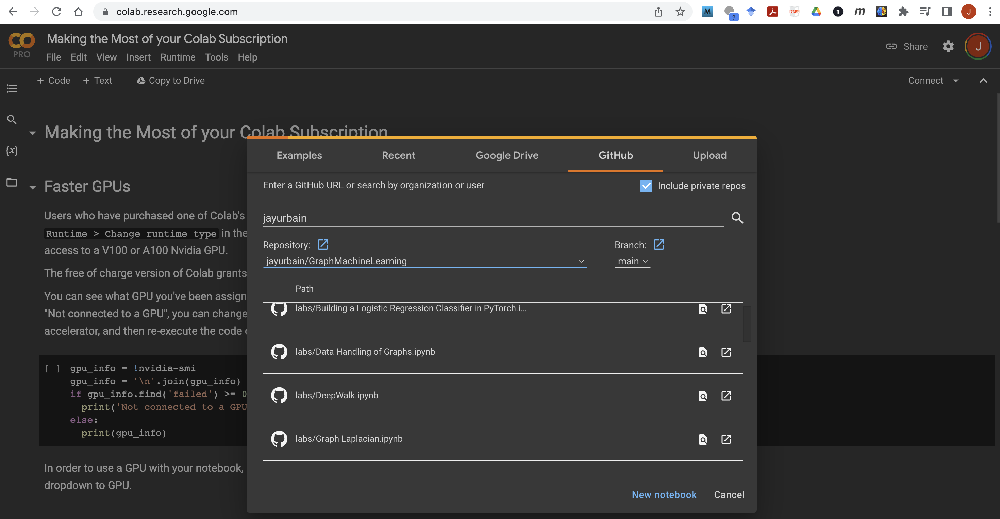

----

### LLM, Knowledge Graphs, and Graph Machine Learning Workshop

Explore integration of Knowledge Graphs, LLMs, and Graph Machine Learning

- Use LLMs to extract entity relation from text to automatically populate a knowledge graph.  
- Use knowledge graphs or knowledge graph embeddings to ground LLM applications (retrieval augmented generation).  
- Graph machine learning to learn node and edge embeddings.

Attendees will need to do the following prior to the workshop:

[Free graph database account at Neo4j](https://neo4j.com/cloud/platform/aura-graph-database/?utm_source=Google&utm_medium=PaidSearch&utm_campaign=UCGenAIutm_content=AMS-Search-SEMCO-UCGenAI-None-SEM-SEM-NonABM&utm_term=neo4j%20ai&utm_adgroup=genai-llm&gad_source=1&gclid=CjwKCAiAopuvBhBCEiwAm8jaMWv4W4m41di5rIUYlb7eMLOpE7IkngU9qEllv_6C6AO7dS1JrNUVLhoCgwoQAvD_BwE)

[OpenAI developer account and key](https://openai.com/blog/openai-api)

#### Lectures      
[Knowledge Graphs, Graph ML, and LLMs](https://docs.google.com/presentation/d/1yPeEIcbIK9occWx-H8hKH81Ya37kXwW6OzUDktkoiZQ/edit?usp=sharing)

[Graph Neural Networks](https://docs.google.com/presentation/d/1EC7-okKsZnDIygkVBlar7udeehdmklrOIim7oObVaYI/edit?usp=sharing)  

#### Tasks       

[Tasl 1: Creating a Knowledge Graph from Text](labs/constructing_knowledge_graph.ipynb)

[Task 2: Creating a Knowledge Graph Embedding](labs/pykeen_knowledge_graph_embedding.ipynb))

#### Optional Tasks - Graph Neural Networks, graph level prediction    

Note: For opening notebooks in colab

_Runtime -> Change Runtime Type -> GPU_



```
# !nvidia-smi

# Add this in a Google Colab cell to install the correct version of Pytorch Geometric.
import torch

def format_pytorch_version(version):
  return version.split('+')[0]

TORCH_version = torch.__version__
TORCH = format_pytorch_version(TORCH_version)

def format_cuda_version(version):
  return 'cu' + version.replace('.', '')

CUDA_version = torch.version.cuda
CUDA = format_cuda_version(CUDA_version)

!pip install torch-scatter     -f https://pytorch-geometric.com/whl/torch-{TORCH}+{CUDA}.html
!pip install torch-sparse      -f https://pytorch-geometric.com/whl/torch-{TORCH}+{CUDA}.html
!pip install torch-cluster     -f https://pytorch-geometric.com/whl/torch-{TORCH}+{CUDA}.html
!pip install torch-spline-conv -f https://pytorch-geometric.com/whl/torch-{TORCH}+{CUDA}.html
!pip install torch-geometric 
```

Select _Runtime -> Restart Runtime_ and start where you left off.

[Lab: Graph Convolutional Network](labs/lab3_handson_gcn.ipynb), [Solution](workshop_solutions/lab3_handson_gcn_solution.ipynb)    
[Lab: Node Classification](labs/lab3_node_class.ipynb), [Solution](workshop_solutions/lab3_handson_gcn_solution.ipynb)     
[Lab: Graph Level Prediction](labs/lab_5_graphneuralnets_esol.ipynb), [Solution](workshop_solutions/lab_5_graphneuralnets_esol_solution.ipynb)   

Workshop 4 - Deep Generative Graph Models,  illustrative notebook   
[Learning Deep Generative Models of Graphs.pdf](slides/14.%20Learning%20Deep%20Generative%20Models%20of%20Graphs.pdf)  

- [Deep Generative Graph Learning Notebook](labs/deep_graph_generative.ipynb)   
- [Model file](labs/model.pth)

